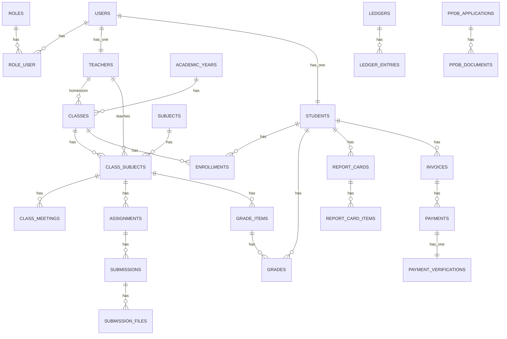

# Arsitektur Sistem Informasi Sekolah (Laravel + TiDB)

> Dokumen ini mendeskripsikan arsitektur aplikasi sekolah yang telah kita susun: gaya arsitektur, modul domain, skema data, API, security, observabilitas, kinerja, CI/CD, hingga pedoman deployment (TiDB Cloud & Namecheap/cPanel).

---

## 1. Tujuan & Ruang Lingkup
- **Domain**: akademik (kelas, mata pelajaran, kurikulum), absensi, penilaian, rapor; keuangan (tagihan/pembayaran), PPDB; notifikasi & audit.
- **Karakter**: **API-first**, **agent-friendly**, **SOLID/DDD-lite**, **event-driven**, **MySQL-compatible (TiDB)** dengan **SSL**.
- **Target non-fungsional**:
  - Keandalan 99.9% untuk endpoint utama (absensi, penilaian).
  - Waktu respon P50 < 150ms, P95 < 500ms pada beban normal.
  - Skalabilitas horizontal via stateless API + cache/queue.
  - Observabilitas: logging terstruktur, metrik, health-check.

---

## 2. Gaya Arsitektur
- **Layered + DDD-lite**:
  - **Presentation (HTTP)**: Controller **tipis** + Request (validasi) + Resource (serialisasi).
  - **Application/Domain**: **Service/Use-case** + **DTO** (input/output), **Event** + **Listener**.
  - **Data Access**: **Repository interface** (mockable) + **Eloquent/DB** implementation.
- **Event-driven integration** untuk side effects (kalkulasi skor absensi, sinkronisasi rapor, posting ledger, proses PPDB).
- **API-first** dengan OpenAPI (spec dapat digenerate dari routes).

### 2.1 Struktur Folder
```
app/
  Domain/
    <Module>/{Entities, DTO, Repositories, Services}
    Attendance/Services/AttendanceScoreService.php
    Finance/Services/FinancePostingService.php
    Events/{AttendanceSessionClosed, GradesUpdated, ...}.php
  Http/
    Controllers/API/
    Requests/<Module>/
    Resources/<Module>/
  Models/ (User, Role, Teacher, Student)
  Providers/
    AuthServiceProvider.php      # Gate isRole:<role>
    EventServiceProvider.php     # Events -> Listeners
config/
  database.php                   # Opsi SSL TiDB (PDO::MYSQL_ATTR_SSL_CA, verify)
database/
  migrations/                    # Skema lengkap (ERD)
  seeders/RolesAndSettingsSeeder.php
routes/
  api.php                        # Endpoint publik
  api.workflows.php.snippet      # Snippet workflow (absensi, nilai, keuangan)
docs/                            # ERD, RBAC, Events, API guide, Deploy
scripts/                         # setup.php (cPanel), run-tests.sh, watcher.sh
```

---

## 3. Model Domain & ERD (ringkas)

### 3.1 Identitas & RBAC
- **users** (akun), **roles**, **role_user** (pivot M:N).
- **teachers** & **students** terkait **users** (1-1); **students** opsional memiliki **homeroom_class**.
- **academic_years** mengelola tahun ajaran aktif.

### 3.2 Akademik Inti
- **classes** (rombongan belajar; wali kelas opsional).
- **subjects** (mapel) & **class_subjects** (kelas–mapel–guru, unik per kombinasi).
- **terms** (semester/term) terkait **academic_years**.
- **enrollments** (siswa per kelas, opsional term).
- **class_meetings** (jadwal mingguan opsional).

### 3.3 Pembelajaran, Absensi, Nilai, Rapor
- **assignments**, **submissions**, **submission_files**.
- **attendance_sessions** (draft/open/closed) & **attendance_records** (status siswa).
- **grade_items** (komponen, bobot) & **grades**.
- **report_cards** & **report_card_items** (agregasi per term).

### 3.4 Keuangan, PPDB, Utilitas
- **invoices**, **payments**, **payment_verifications**.
- **ledgers**, **ledger_entries** (posting idempotent).
- **ppdb_applications**, **ppdb_documents**.
- **settings** (konfigurasi global, mis. bobot absensi).
- **notifications**, **activity_logs** (audit).

### 3.5 ERD (Mermaid)
> Diagram ringkas; detail kolom dan indeks ada di migration.


---

## 4. RBAC & Keamanan
- **Gate**: `isRole:<slug>` pada `AuthServiceProvider`. Peran: `super-admin, admin, akademik, keuangan, operator-ppdb, guru, wali-kelas, siswa`.
- **Auth**: **Laravel Sanctum** (token bearer) untuk API.
- **Policies** (disarankan): granular per model (Student, Grade, Attendance, Invoice).
- **Validation**: input divalidasi di `FormRequest`.
- **Rate limiting**: pada endpoint kritikal (login, import).
- **Audit trail**: `activity_logs` + korelasi request id pada log.

---

## 5. Desain API
- **RESTful**: `Route::apiResource` per entitas dasar; sub-resource untuk koleksi terkait.
- **Filter/Sort/Pagination**: `?q=&sort=&per_page=` (gunakan paginator Laravel).
- **Error mapping**: 400/401/403/404/409/422 sesuai kasus (mis. kapasitas penuh, bentrok jadwal → 409).
- **Health-check**: `/health` mengembalikan status DB + versi.
- **OpenAPI**: spesifikasi disimpan di `docs/openapi.*` (stub tersedia; dapat digenerate dari routes).

### 5.1 Workflows Utama
- **Absensi** (role: `guru`):
  - `POST /attendance/sessions` → draft
  - `POST /attendance/sessions/{id}/open` → open
  - `POST /attendance/sessions/{id}/records` → bulk isi
  - `POST /attendance/sessions/{id}/close` → event `AttendanceSessionClosed`
- **Penilaian → Rapor** (role: `guru`):
  - `POST /grades/upsert` → event `GradesUpdated` → sinkronisasi `report_card_items` & `final_score`.
- **Keuangan** (role: `keuangan`):
  - `POST /payments/{id}/verify` → event `PaymentVerified` → posting idempotent ke `ledger_entries`.
- **PPDB** (role: `operator-ppdb`/`admin`):
  - Verifikasi → event `PpdbVerified` → pembuatan akun & profil siswa.

---

## 6. Lapisan Aplikasi (SOLID/DDD-lite)
- **Controller**: tipis; hanya otorisasi + orkestrasi.
- **Request**: validasi; mapping ke **DTO**.
- **Service/Use-case**: bisnis utama (enroll dengan kapasitas, bentrok jadwal, rekap nilai/presensi).
- **Repository**: interface (mockable) + implementasi Eloquent/DB (gunakan indeks yang tepat).
- **Resource**: serialisasi keluar (tata tanggal/angka konsisten).
- **Events/Listeners**: side effects async-ish (tetap sinkron by default; bisa dipindah ke queue).

Contoh implementasi tersedia pada paket `Student` dan workflows (Absensi/Nilai/Finance).

---

## 7. Data & Migrasi
- **Migrations**: satu set lengkap sesuai ERD (unik/indeks komposit pada kombinasi penting).
- **Seeder**: `RolesAndSettingsSeeder` (peran & bobot absensi default).
- **Strategi**:
  - **Forward-only** di produksi; `down()` tetap disediakan untuk pengembangan.
  - Hindari alter tabel masif saat puncak trafik; gunakan migrasi bertahap.
- **Integritas**: gunakan FK `cascade`/`nullOnDelete` sesuai kebutuhan; uniq & index pada `code`, `nis`, `nisn`, `(class_id, student_id, term_id)` dkk.

---

## 8. TiDB Cloud (MySQL-compatible)
- **Koneksi**: host TiDB Cloud (port **4000**) dengan **SSL**.
- **ENV** (contoh):
  ```env
  DB_HOST=gateway01.ap-northeast-1.prod.aws.tidbcloud.com
  DB_PORT=4000
  DB_DATABASE=<db>
  DB_USERNAME=<user>
  DB_PASSWORD=<pass>
  MYSQL_ATTR_SSL_CA=C:\\path\\to\\isrgrootx1.pem
  MYSQL_ATTR_SSL_VERIFY_SERVER_CERT=true
  DB_CHARSET=utf8mb4
  DB_COLLATION=utf8mb4_unicode_ci
  ```
- **PDO options** (`config/database.php`):
  ```php
  'options' => array_filter([
    PDO::MYSQL_ATTR_SSL_CA => env('MYSQL_ATTR_SSL_CA'),
    defined('PDO::MYSQL_ATTR_SSL_VERIFY_SERVER_CERT') ? PDO::MYSQL_ATTR_SSL_VERIFY_SERVER_CERT : null
      => filter_var(env('MYSQL_ATTR_SSL_VERIFY_SERVER_CERT', true), FILTER_VALIDATE_BOOL),
  ]),
  ```
- **Praktik baik**:
  - Tetap **strict mode** + `utf8mb4`.
  - Hindari transaksi panjang; gunakan **queue** untuk rekap/import besar.
  - Gunakan **EXPLAIN** untuk query kompleks; pastikan indeks termanfaatkan.

---

## 9. Kinerja & Skalabilitas
- **N+1 guard**: gunakan eager loading (`with`) & test untuk mencegah regresi.
- **Caching**: rekap berat (absensi/nilai) berdasarkan `class_id`/`term_id` dengan TTL wajar (Redis).
- **Queue & Batch**: job untuk import CSV & rekap; pastikan idempotensi.
- **Indexing**: tambah indeks sesuai profil query; sediakan **komposit** untuk kolom filter utama.

---

## 10. Observabilitas
- **Logging**: format JSON, sertakan `request_id` & user id.
- **Metrics**: latency endpoint, error rate 4xx/5xx, jumlah enrol/absensi.
- **Tracing (opsional)**: OpenTelemetry (SDK PHP) bila diperlukan.
- **Health**: endpoint `/health` + check koneksi DB; alarm pada kegagalan.

---

## 11. Keamanan
- **AuthN**: Sanctum (token bearer) untuk API.
- **AuthZ**: Gate `isRole:<role>` + **Policies** untuk objek.
- **Input safety**: validasi ketat; batasi ukuran upload untuk `submission_files`.
- **Rate limit**: login/import/rekap.
- **Secrets**: simpan di ENV/secret manager; **jangan commit** password/CA path.

---

## 12. Testing & QA
- **Unit**: Service, DTO, kalkulasi bobot.
- **Feature**: alur absensi, penilaian→rapor, verifikasi pembayaran→posting ledger, PPDB→akun siswa.
- **Contract/API**: uji respons berdasarkan OpenAPI (Dredd/Prism atau test kustom).
- **Performance**: skenario rekap, enrol massal.
- **Lint/Static analysis**: Pint + PHPStan (lvl tinggi).

---

## 13. CI/CD
- **CI** (GitHub Actions):
  - Matrix PHP 8.2/8.3
  - Steps: install → lint (Pint) → static (PHPStan) → test (Pest) → build artefak dokumen (OpenAPI)
- **CD**:
  - Env prod: `composer install --no-dev --optimize-autoloader`
  - `php artisan migrate --force`
  - Cache config/routes/view bila perlu.

---

## 14. Deployment
### 14.1 TiDB Cloud
- Pastikan IP ter-allow.
- Gunakan SSL CA & VERIFY_SERVER_CERT.
- Jalankan migrasi & seeder.

### 14.2 Namecheap/cPanel
- Document root → `public/`.
- `composer install --no-dev`.
- Set `.env` (biasanya `DB_HOST=localhost` untuk DB cPanel).
- `php artisan key:generate` → `php artisan migrate --force`.
- Cron: backup DB, `php artisan schedule:run` per menit.
- `scripts/setup.php` untuk validasi lingkungan & SQL awal idempotent.

---

## 15. Konvensi & Pedoman Kode
- **Naming**: PascalCase untuk kelas, snake_case untuk kolom DB, kebijakan slug untuk roles.
- **DTO**: khusus input/output domain; hindari leak Eloquent ke layer domain.
- **Controller**: maksimal 100–150 baris; delegasikan ke Service.
- **Resource**: konsisten field dan format tanggal (ISO 8601).

---

## 16. Ekstensi & Peta Jalan
- Lengkapi controller/request/resource untuk **Assignments, Submissions (multi-file), GradeItems/Grades, Finance, PPDB**.
- Endpoint **rekap** & **export CSV**.
- **Policies** per model; middleware role untuk rute.
- OpenAPI lengkap + Postman/Insomnia collection.
- Queue untuk import besar & perhitungan rapor berat.
- Peningkatan audit (immutable log) & notifikasi real-time (WebSocket/FCM optional).

---

## 17. Risiko & Mitigasi
- **Bottleneck query** → Profiling + indeks komposit + cache/queue.
- **Data consistency** → Event idempotent; transaksi sempit; fallback SAGA sederhana bila perlu.
- **Shared hosting limit** → Optimalkan paket, cron ringan, nonaktifkan debug, gunakan SQL idempotent.

---

## Lampiran A — Contoh Gate & Middleware
```php
// AuthServiceProvider::boot()
Gate::define('isRole', fn(User $u, string $role) => $u->roles()->where('slug', $role)->exists());

// Contoh pemakaian di controller
Gate::authorize('isRole', 'guru');
```

## Lampiran B — Opsi PDO SSL (TiDB)
```php
'options' => array_filter([
  PDO::MYSQL_ATTR_SSL_CA => env('MYSQL_ATTR_SSL_CA'),
  defined('PDO::MYSQL_ATTR_SSL_VERIFY_SERVER_CERT') ? PDO::MYSQL_ATTR_SSL_VERIFY_SERVER_CERT : null
    => filter_var(env('MYSQL_ATTR_SSL_VERIFY_SERVER_CERT', true), FILTER_VALIDATE_BOOL),
]),
```

## Lampiran C — Health-check
```php
Route::get('/health', function () {
  try { DB::connection()->getPdo(); $db = 'ok'; } catch (\Throwable $e) { $db = 'fail'; }
  return response()->json(['status'=>'ok', 'db'=>$db, 'version'=>config('app.version')], 200);
});
```

---

**Status**: baseline arsitektur sudah tersedia di paket yang kamu unduh. Dokumen ini menjadi rujukan implementasi & review arsitektur berikutnya.
